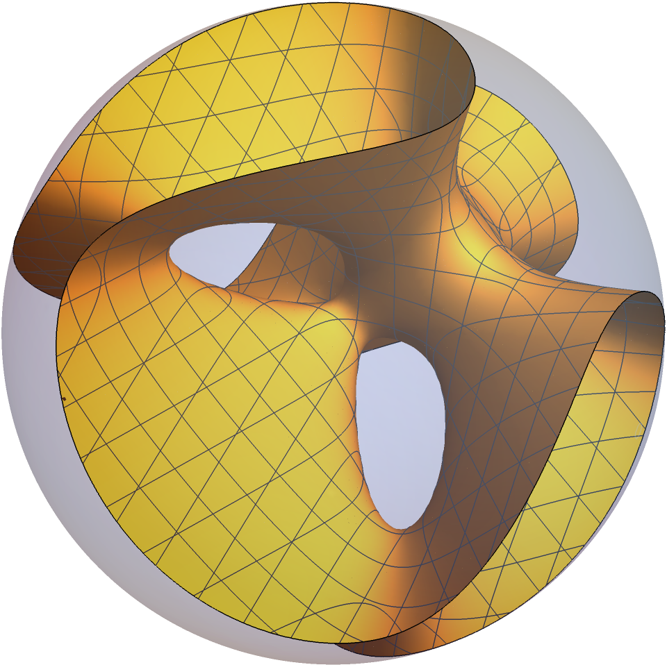
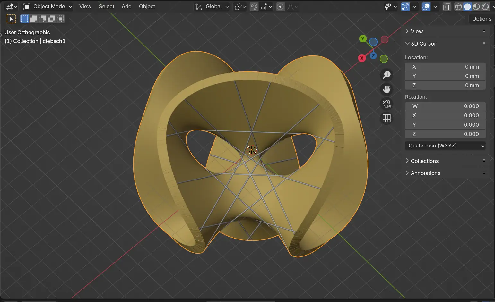
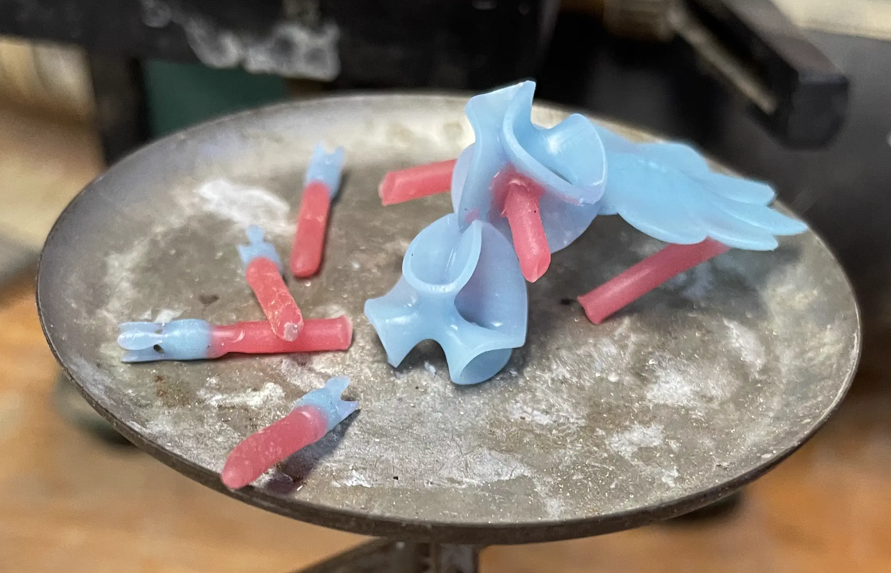
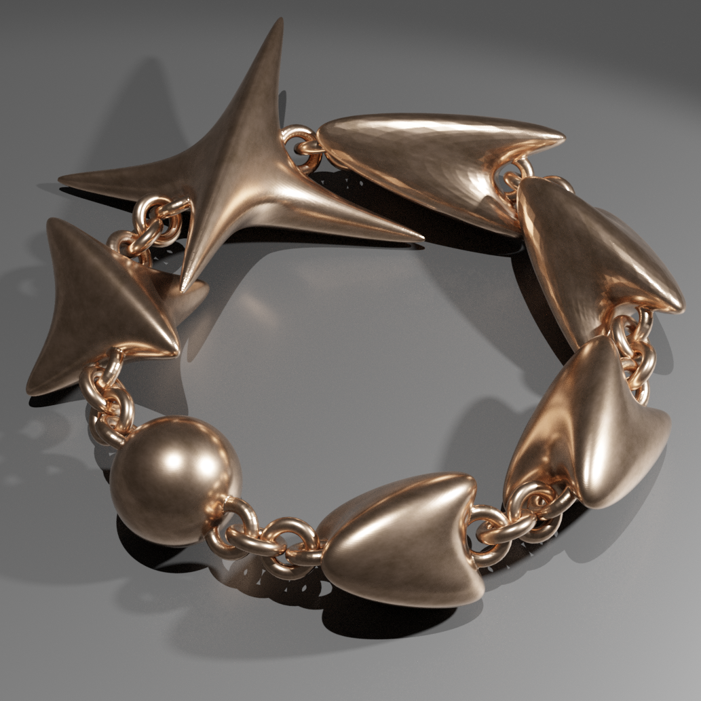
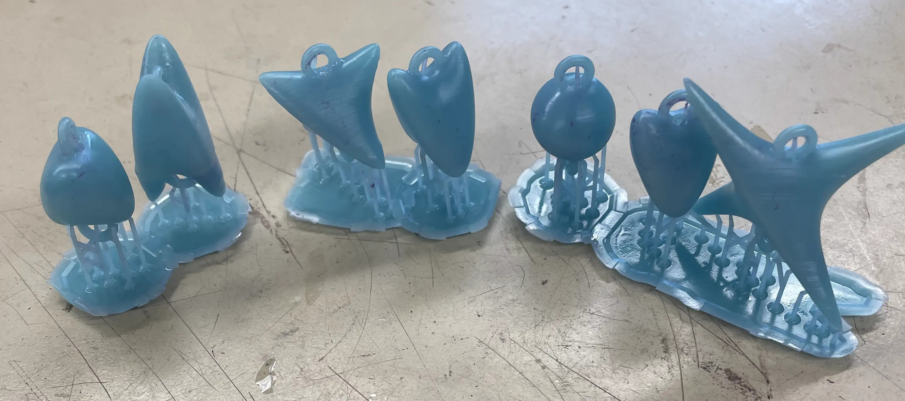
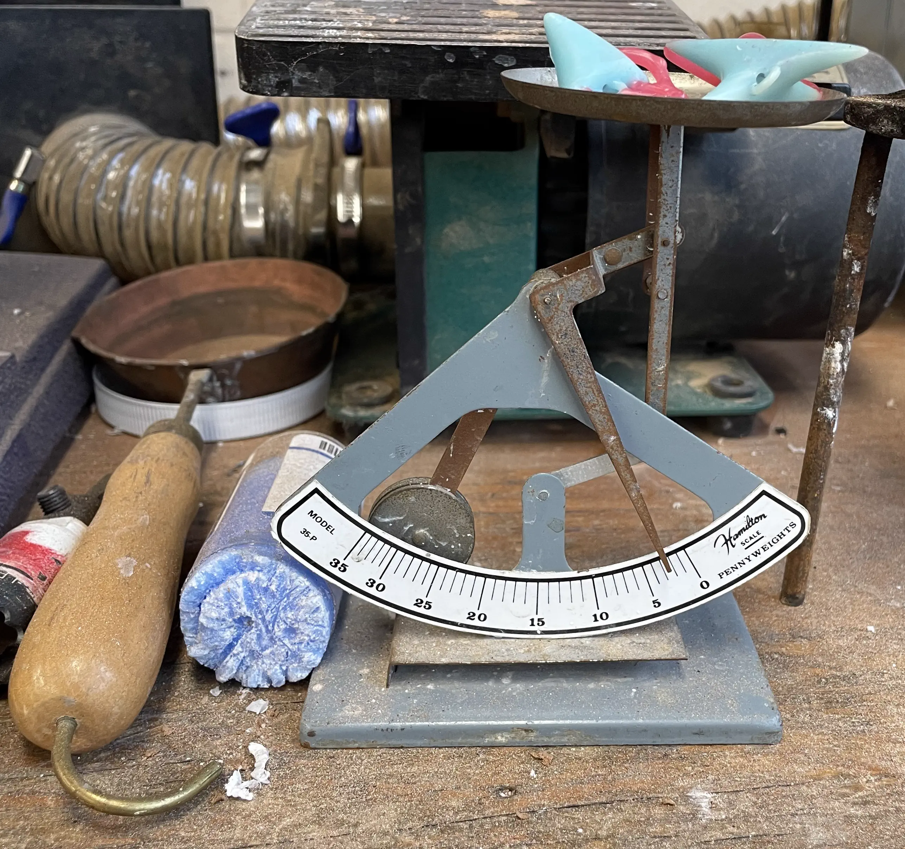
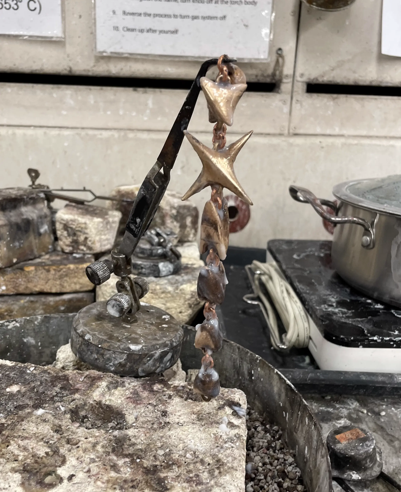
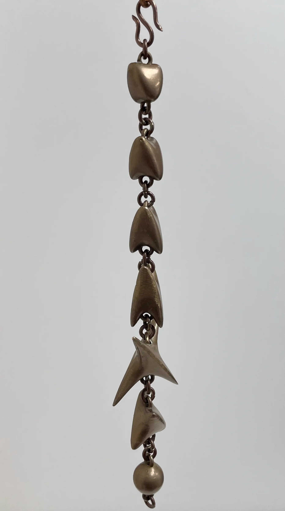
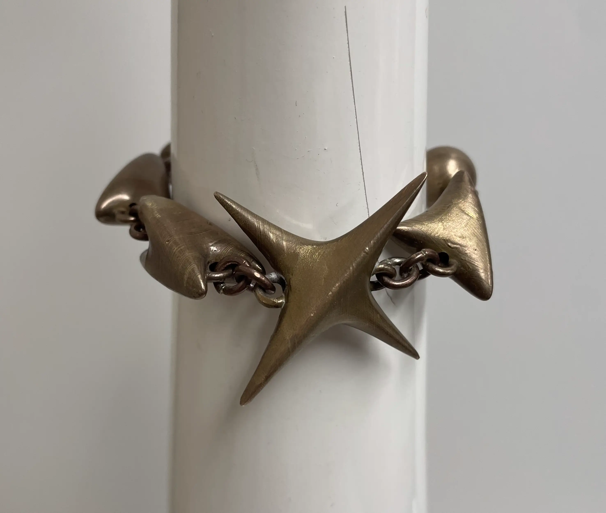
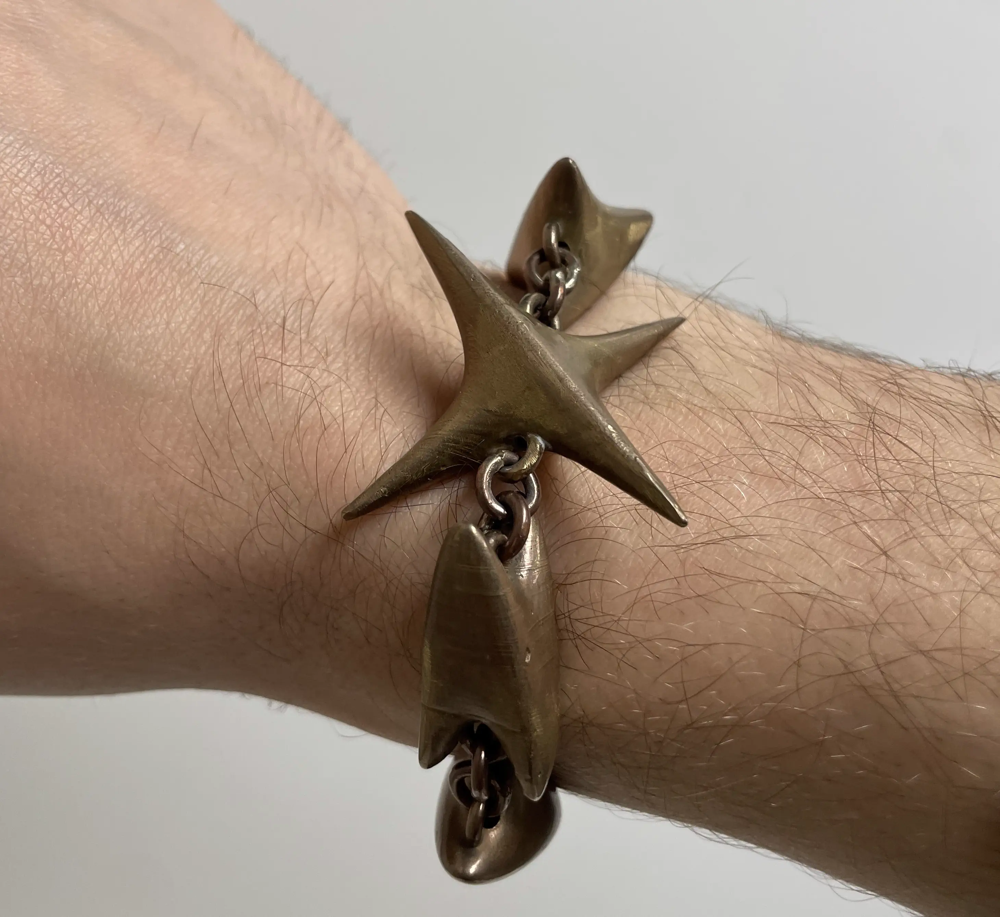

+++
date = '2024-03-23T18:16:20-04:00'
draft = true
title = 'Jewelry'
+++

In the spring of 2025 I took a metal casting class and I decided to make a
couple mathematically inspired pieces out of silver and bronze.

## Clebsch Cubic Earrings/Pendant

I made several pendants and a pair of earrings of the Clebsch cubic surface.

### Mathematica Plot

I started by plotting the following equation which is gives one affine view of
the clebsch cubic:
$$ {\displaystyle
{\begin{array}{c}
    81\left(x^{3}+y^{3}+z^{3}\right)-189\left(x^{2}\left(y+z\right)+y^{2}\left(z+x\right)+z^{2}\left(x+y\right)\right)+\\
    +54xyz+126\left(xy+yz+zx\right)-9\left(x^{2}+y^{2}+z^{2}\right)-9\left(x+y+z\right)+1=0,
\end{array}}} $$
with a domain of the unit ball.

### Design in Blender

I then had Mathematica export this plot as a .obj file and opened it in blender
to add thickness to the surface.

At one point I was considering featuring the 27 lines in the final piece but I
decided it would look too cluttered at the scale I was going for. Plus, the
printer might print them with irregular thickness, and the lines would restrict
what sanding and polishing I could do at the end.

After 3D printing in castable wax and attaching the red sprues for the metal to
flow through, it was time to weigh and determine how much metal was needed for
the cast.

I ended up making several bronze pendants and this set of silver earrings.

## Balls of Nil and Sol Bracelet

I also made a bracelet made of various metric balls in the Nil and Sol geometries.

I was inspired by [Remi Coulon](https://rcoulon.perso.math.cnrs.fr/)'s 3D
printing of [Balls in Nil and
Sol.](https://im.icerm.brown.edu/portfolio/balls-in-nil-and-sol/)




