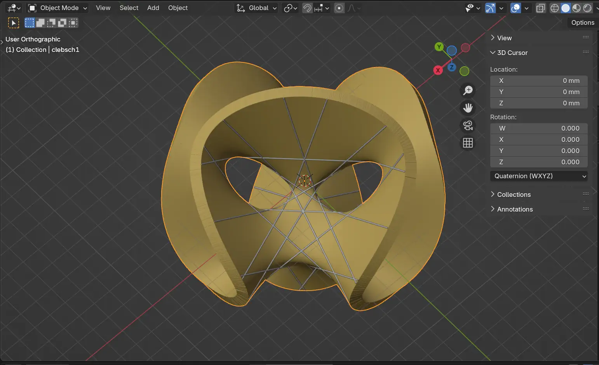
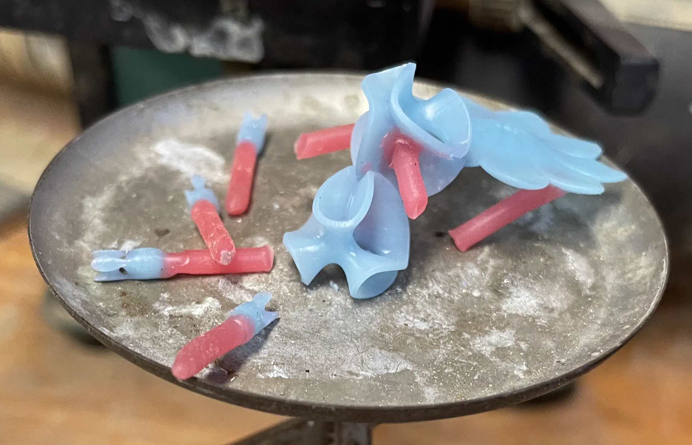
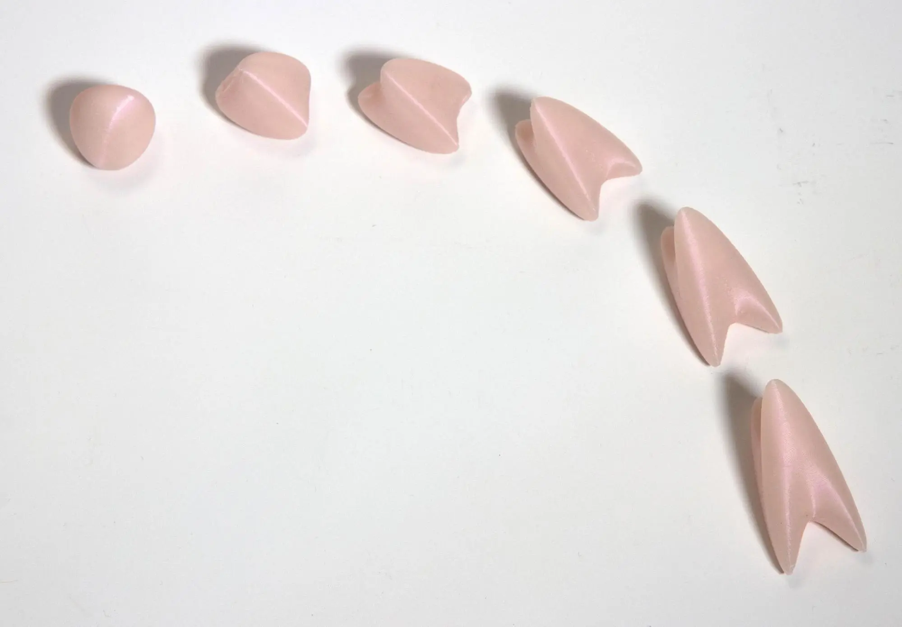
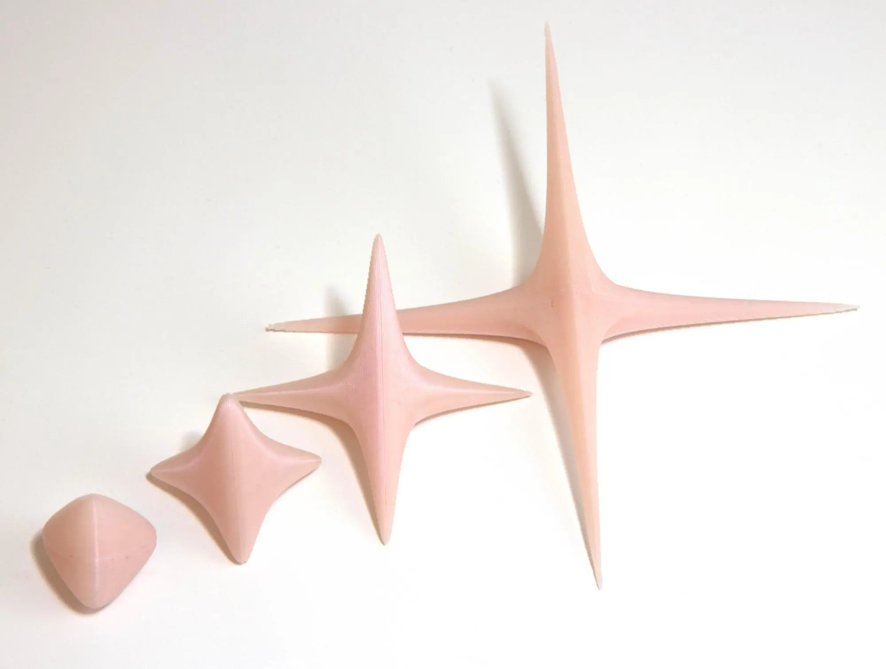
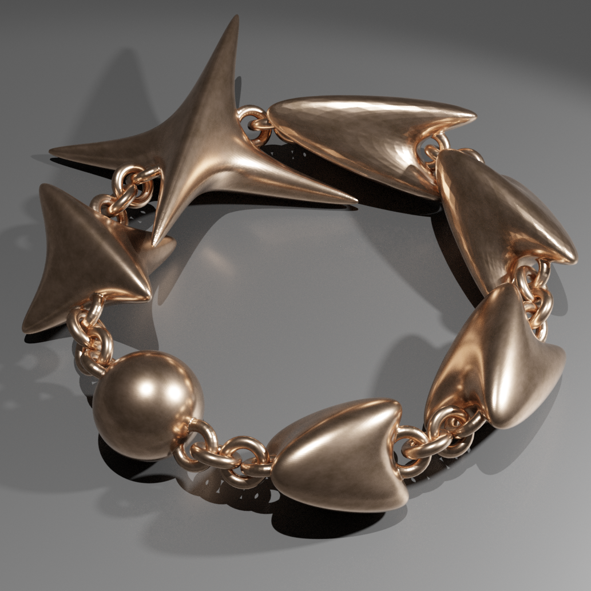
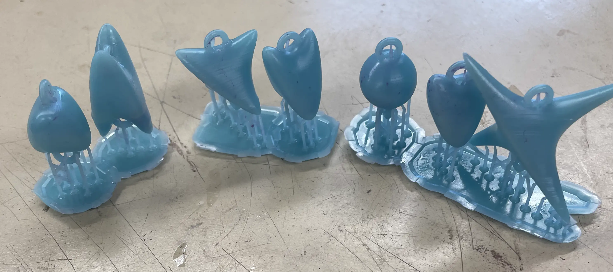
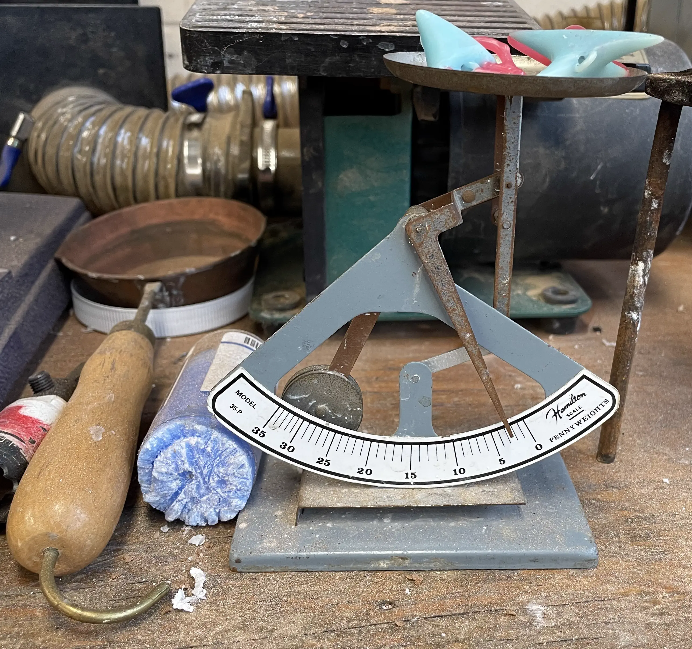
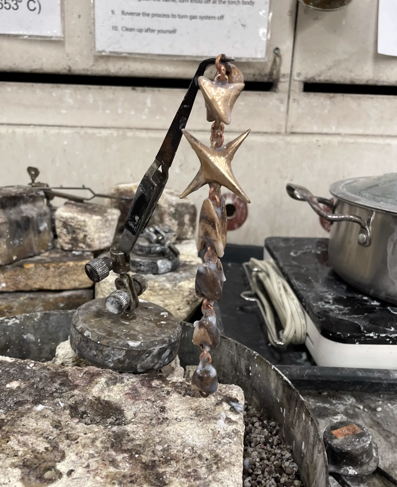

#+hugo_base_dir: ../../../
#+hugo_section: posts
#+hugo_bundle: jewelry
#+export_file_name: index
#+title: Jewelry
#+date: 2024-03-23T18:16:20-04:00
#+hugo_draft: true

In the spring of 2025 I took a metal casting class and I decided to make
a couple mathematically inspired pieces out of silver and bronze.

** Clebsch Cubic Earrings/Pendant

I have been fascinated by visualizing cubic surfaces for a while. Check out my
[[https:ruppec.github.io/2026mathcomps/posts/symmetric_cubics/][non-euclidean raytracer project that renders symmetric cubic
surfaces]].

For this project I made several pendants and a pair of earrings of the Clebsch cubic
surface.

*** Mathematica Plot
I started by plotting the following equation which gives one affine
view of the Clebsch cubic:

\[
{\displaystyle
{\begin{array}{c}
    81\left(x^{3}+y^{3}+z^{3}\right)-189\left(x^{2}\left(y+z\right)+y^{2}\left(z+x\right)+z^{2}\left(x+y\right)\right)+\\
    +54xyz+126\left(xy+yz+zx\right)-9\left(x^{2}+y^{2}+z^{2}\right)-9\left(x+y+z\right)+1=0.
\end{array}}}
\]

I had to tweak the settings a bit to get a mesh with sufficient quality. Here is
the Mathematica code and the generated plot:
#+begin_src mathematica
eq = 81 (x^3 + y^3 + z^3) - 
   189 (x^2 (y + z) + y^2 (z + x) + z^2 (x + y)) + 54 x y z + 
   126 ( x y + y z + z x) - 9 (x^2 + y^2 + z^2) - 9 ( x + y + z) + 
   1 ;
ContourPlot3D[{eq == 0}, {x, y, z} \[Element] Ball[{0, 0, 0}, 1], 
 PerformanceGoal -> "Quality", MaxRecursion -> 6, PlotPoints -> 120, 
 Boxed -> False, Axes -> False, Method -> {"ShrinkWrap" -> True}]
#+end_src

#+begin_export html

#+end_export

*** Design in Blender
    :PROPERTIES:
    :CUSTOM_ID: design-in-blender
    :END:
I then had Mathematica export this plot as a .obj file and opened it in
blender to add thickness to the surface.

#+caption: Blender Model of the Print

At one point I was considering featuring the 27 lines in the final piece
but I decided it would look too cluttered at the scale I was going for.
Plus, the printer might print them with irregular thickness, and the
lines would restrict what sanding and polishing I could do at the end.

After 3D printing in castable wax and attaching the red sprues for the metal to
flow through, it was time to weigh the positives and determine how much metal
was needed for the cast. 

I ended up making several bronze pendants and this set of silver
earrings.

** Balls of Nil and Sol Bracelet
   :PROPERTIES:
   :CUSTOM_ID: balls-of-nil-and-sol-bracelet
   :END:
I also made a bracelet made of various metric balls in the Nil and Sol
geometries.

I was inspired by [[https://rcoulon.perso.math.cnrs.fr/][Remi Coulon]]'s 3D
printing of [[https://rcoulon.perso.math.cnrs.fr/improject/spheres/][Spheres in
the Nil and Sol Geometries]].
#+caption: The balls of radius 1, 2, 3, 4, 5, 6 in the Nil geometry.

#+caption: The ball of radius 1, 2, 3, 4 in the Sol geometry.

What is shown are a Euclidean view of non-Euclidean metric balls centered at the
origin of various sizes, then rescaled to be roughly the same size.
The Nil and Sol geometries are formed by taking $\mathbb R^3$ and imposing a different metric.

*** Creating the bracelet

Rémi Coulon has some models on his website but I wanted more so I ended up
writing Mathematica code to generate the surfaces.

I then exported the objects to blender and arranged them with geometry
nodes to make sure everything fit together.

#+caption: Computer Render of Bracelet of Nil and Sol spheres.

I then went through the same process of printing positives, sprueing, weighing,
and casting. One detail that may be hard to see is that the models are actually
hollow. That way you aren't wearing a massive piece of bronze on your wrist.

#+caption: First print of positives.

#+caption: Weighing the positives.

To link everything together I made some brass jump rings and soldered the
bracelet closed.

#+caption: Soldering the jump rings.

To finish I did some spot sanding, and burnished with a metal brush and steel shot tumbling.

#+begin_export html

  
  
  

#+end_export

